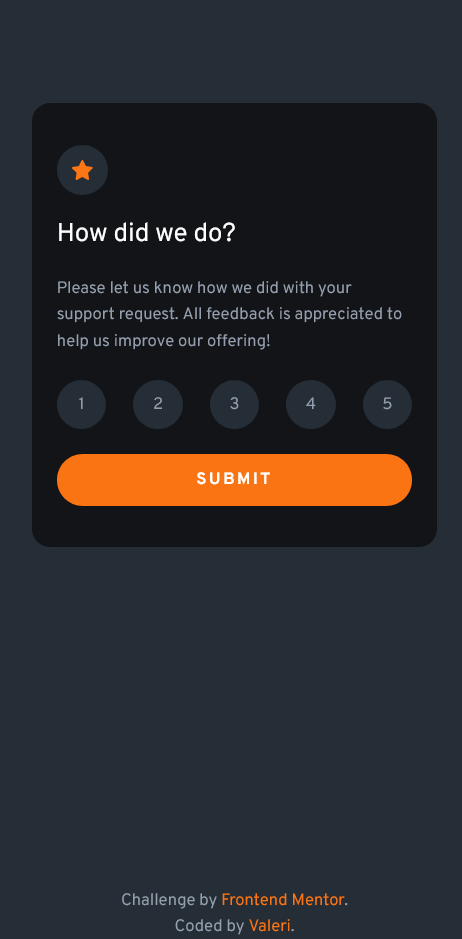
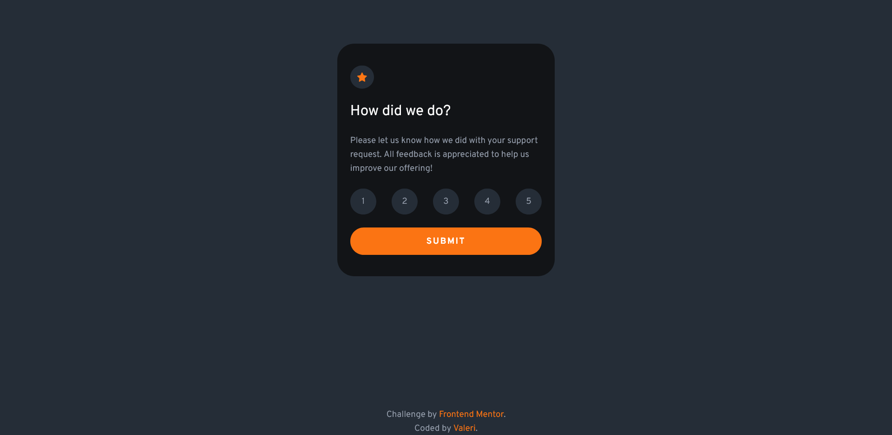

# Frontend Mentor - Interactive rating component solution

This is a solution to the [Interactive rating component challenge on Frontend Mentor](https://www.frontendmentor.io/challenges/interactive-rating-component-koxpeBUmI). Frontend Mentor challenges help you improve your coding skills by building realistic projects.

## Table of contents

-   [Overview](#overview)
    -   [The challenge](#the-challenge)
    -   [Screenshot](#screenshot)
    -   [Links](#links)
-   [My process](#my-process)
    -   [Built with](#built-with)
-   [Author](#author)

## Overview

### The challenge

Users should be able to:

-   View the optimal layout for the app depending on their device's screen size
-   See hover states for all interactive elements on the page
-   Select and submit a number rating
-   See the "Thank you" card state after submitting a rating

### Screenshot

#### Mobile design

#### Desktop design

### Links

-   Solution URL: [Frontend Mentor solution URL](https://www.frontendmentor.io/solutions/interactive-rating-component-FbewU8Xoxh)
-   Live Site URL: [Interactive rating component](https://interactive-rating-component-front-end-mentor.vercel.app)

## My process

### Built with

-   Semantic HTML5 markup
-   CSS custom properties
-   Flexbox
-   CSS Grid
-   Mobile-first workflow
-   [PnPm](https://pnpm.io/) - Fast, disk space efficient package manager
-   [Vite](https://vitejs.dev/) - Next Generation Frontend Tooling
-   [SASS](https://sass-lang.com/) - CSS Preprocessor
-   [CSS Modules](https://github.com/css-modules/css-modules) - For styles
-   [React](https://reactjs.org/) - JS library
-   [React Router](https://reactrouter.com/) - Routing library for React
-   [Typescript](https://www.typescriptlang.org/) - Superset of JavaScript

## Author

-   Frontend Mentor - [@Valeri](https://www.frontendmentor.io/profile/Valeri85)
-   Twitter - [@Valeri79125128](https://twitter.com/Valeri79125128)
